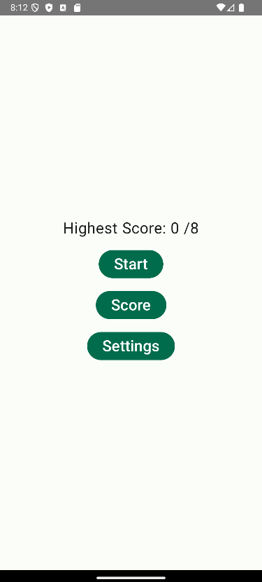
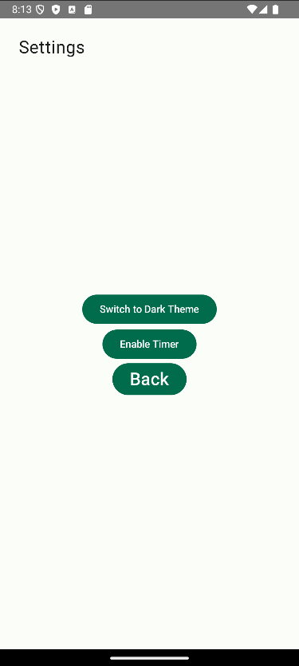
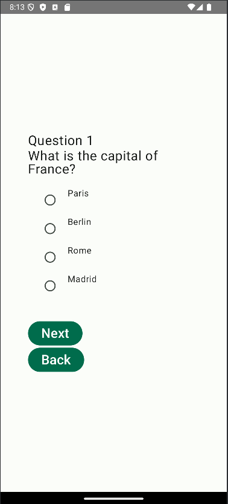

# Quiz Application 

## Overview

The Quiz App is a Kotlin-based Android application developed using Jetpack Compose. It allows users to engage in a fun and interactive quiz experience, complete with theme settings, a timer, and persistent high scores. The app is user-friendly, visually appealing, and offers a seamless navigation structure.

## Features

- Dark and Light Themes: Users can switch between dark and light themes for a personalized visual experience.

- Timer: A countdown timer is included to enhance the challenge and pace of the quiz.

- Persistent High Scores: High scores are saved locally, allowing users to track their progress over time.

- Interactive Navigation: Smooth navigation between screens for a hassle-free experience.

- Summary Screen: At the end of the quiz, users can view their results along with correct answers and their selected answers.

## App Screens

- Home Screen: Allows users to start the quiz or view high scores.

- Quiz Screen: Displays the questions, options, and timer. Users can select an answer or skip to the next question.

- Result Screen: Shows a summary of the user's performance, including correct and incorrect answers.

- Settings Screen: Enables switching between dark and light themes.

- High Scores Screen: Displays a list of top scores.

## Technologies Used

- Kotlin: For application development.

- Jetpack Compose: For building the UI declaratively.

- Datastore: For storing persistent high scores.

- ViewModel and StateFlow: For managing app state and ensuring responsiveness.

## How to Run

- Clone the repository:

git clone https://github.com/yourusername/quiz-app.git

- Open the project in Android Studio.

- Sync the Gradle files.

- Run the app on an emulator or a physical device.

## Future Enhancements

- Question Categories: Allow users to select quiz topics.

- Multiplayer Mode: Introduce a competitive mode for multiple users.

- Cloud Sync: Enable saving high scores to the cloud for cross-device access.

- Advanced Timer Options: Add features like pausing or extending the timer.

## Credits

- Developer: Palak Sharma

- Technology: Kotlin, Jetpack Compose, Room Database

## License

This project is licensed under the MIT License. See the LICENSE file for more details.
